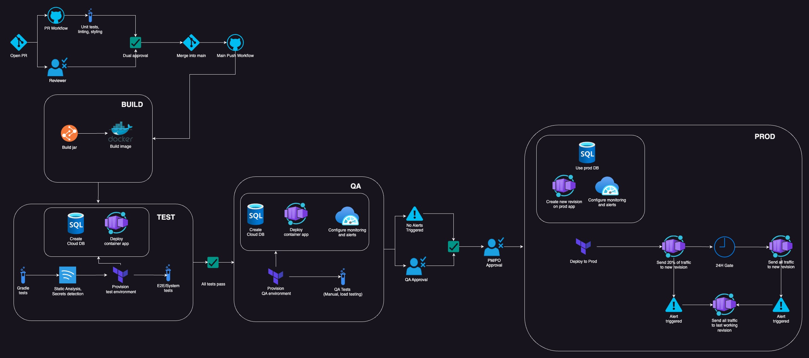

# SAS Take-home Assignment

This repo is my attempt at gaining practical knowledge about implementing a CI/CD pipeline using Azure and Github Actions. 
Although incomplete compared to my design diagram, I was able to implement ~70% of what was described.

## Features
Here's what this repo does have:

- Automated PR workflows for building and testing changes
- A 3-environment workflow utilizing Terraform for ephemeral environment creation
- Basic samples of unit tests, integration tests, and e2e tests
- Two-layer gated approval for prod deployment
- Blue/Green deployments using Container App Revisions

## WIP
The things missing from the implementation are:
- **Automated alert provisioning w/ rollback**: My initial plan was to do this with Azure functions
using a CLI script. Unfortunately, Azure functions seems to push you towards using SDKs,
and the container apps SDK for python seems to be extremely difficult to navigate currently. I was not able to find the functionality
I needed in time to implement it.
- **Gated 24hr promotion for blue/green deployments**: ^ Above was a piece in this pipeline, so
this got cancelled as well.
- **Linting, static analysis, secrets detection**: This was a low priority for me, and got cut due to time.

